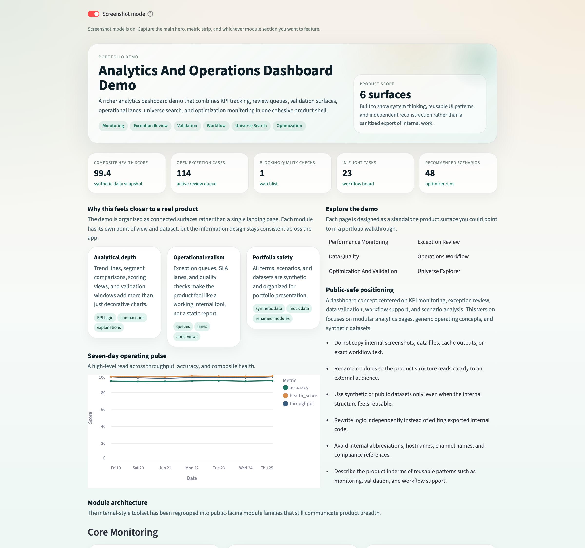

<div align="center">
  <h1>Public Dashboard Portfolio Demo</h1>
  <p><strong>A privacy-safe multi-module analytics dashboard built with synthetic data and generic product framing.</strong></p>
  <p>Designed to showcase dashboard architecture, metric storytelling, workflow support, and internal-tool product thinking.</p>
</div>

<p align="center">
  <code>dashboard design</code>
  <code>operations analytics</code>
  <code>synthetic data</code>
  <code>streamlit app</code>
  <code>product thinking</code>
</p>

## Preview



## Overview

This project can be described as a multi-module analytics and operations dashboard demo. It highlights how complex business questions can be translated into a clear interface with metrics, filters, investigation views, workflow helpers, and validation tooling.

## Highlights

- Performance monitoring dashboard
- Exception review and anomaly tracking
- Data quality and validation views
- Operations workflow support
- Optimization and scenario analysis
- Universe explorer and coverage review

## What It Shows

- Dashboard information architecture
- KPI design and metric storytelling
- Interactive filtering and drill-down analysis
- Data processing and validation workflows
- Multi-page app structure
- Streamlit-based internal tooling design
- Plotly and table-based reporting patterns

## Data Note

All metrics, entities, and workflows in this repo are synthetic. The project is designed to demonstrate dashboard structure, information hierarchy, and workflow-oriented analytics design without exposing proprietary material.

## Quick Start

```bash
python3 -m venv .venv
source .venv/bin/activate
pip install -r requirements.txt
streamlit run app.py
```

## Project Structure

- `app.py`: multipage Streamlit landing page with overview, snapshot tables, and navigation links
- `pages/0_Portfolio_Cover.py`: screenshot-friendly cover page for README or portfolio hero images
- `pages/1_Performance_Monitoring.py`: KPI monitoring and trend analysis
- `pages/2_Exception_Review.py`: anomaly review queue with severity and aging views
- `pages/3_Data_Quality.py`: validation health board and run history
- `pages/4_Operations_Workflow.py`: workflow board with SLA risk and handoff lanes
- `pages/5_Optimization_And_Validation.py`: scenario analysis, validation windows, and allocation mix
- `pages/6_Universe_Explorer.py`: searchable universe explorer with coverage and readiness views
- `src/demo_content.py`: module descriptions and product copy
- `src/mock_data.py`: deterministic synthetic datasets for the demo
- `src/dashboard_ui.py`: shared design system helpers and styling
- `docs/PRODUCT_STRUCTURE.md`: public-facing product structure map
- `docs/PORTFOLIO_COPY.md`: example project summary copy
- `docs/SAFE_REBUILD_CHECKLIST.md`: publishing checklist

## Stack

- Python
- Streamlit
- Pandas
- Plotly
- Synthetic datasets

## Notes

- The app focuses on dashboard structure, information hierarchy, and workflow-oriented analytics design.
- All data and business labels are generic and synthetic.
