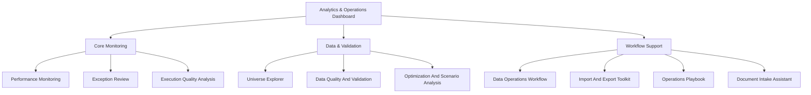

# Public Product Structure

This document turns the original internal dashboard idea into a portfolio-safe product map.

## Product framing

The public version should be presented as a multi-module analytics and operations dashboard. The focus is not on the original business domain, but on the reusable product patterns:

- KPI monitoring
- anomaly review
- data validation
- scenario analysis
- workflow tooling
- operational playbooks

## Module architecture

## Public module lineup

| Product group | Public-facing module |
| --- | --- |
| Core Monitoring | Performance Monitoring |
| Core Monitoring | Exception Review |
| Core Monitoring | Execution Quality Analysis |
| Data And Validation | Universe Explorer |
| Data And Validation | Data Quality And Validation |
| Data And Validation | Optimization And Scenario Analysis |
| Workflow Support | Data Operations Workflow |
| Workflow Support | Import And Export Toolkit |
| Workflow Support | Operations Playbook |
| Workflow Support | Document Intake Assistant |

## What each public module is meant to show

### Performance Monitoring

Show headline metrics, daily status, and quick drill-down entry points.

### Exception Review

Show how anomalies are grouped, filtered, reviewed, and resolved.

### Execution Quality Analysis

Show comparisons, segmentation, and quality benchmarking across categories.

### Universe Explorer

Show search, metadata inspection, and coverage checking.

### Data Quality And Validation

Show health checks, missing-data detection, and result validation.

### Optimization And Scenario Analysis

Show experiment history, validation summaries, and what-if comparisons.

### Data Operations Workflow

Show intake steps, workflow progress, and structured task handoff.

### Import And Export Toolkit

Show upload, package generation, and reviewable output flows.

### Operations Playbook

Show timed response workflows, role split, and communication guidance.

### Document Intake Assistant

Show OCR or text extraction ideas in a generic way.

## Build guidance

- Start with the homepage, then add one representative module from each group.
- Prefer synthetic data that is shaped like the real problem, not copied from it.
- Keep naming generic enough that the original firm or process is not recognizable.
- Treat the public demo as a new product inspired by your experience, not as a sanitized export.
